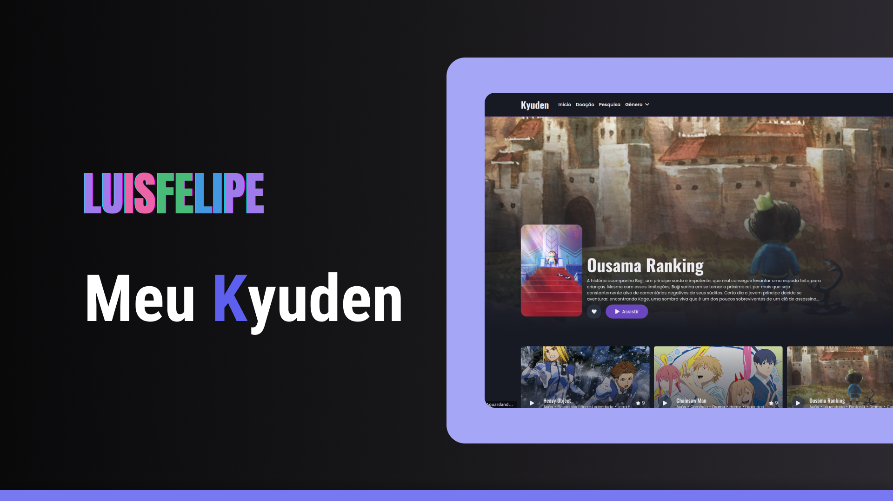

<h1  align="center">
    Meu Kyuden
</h1>

<p align="center">
  
  
  
</p>

<h4 align="center"> 
	✔️ 🚀 Concluido  ✔️
</h4>

<p align="center">
 <a href="#Tecnologias">Tecnologias</a> |
 <a href="#Como rodar o projeto">Como rodar o projeto</a> |
 <a href="#autor">Autor</a>
</p>





## Tecnologias

Este projeto foi desenvolvido com as seguintes tecnologias:

- NextJS
- Firebase
- SCSS


## Como rodar o projeto

Clone o projeto e acesse a pasta.

```bash
$ git clone https://github.com/Luis-Felipe-N/portfolio-next.git
$ cd portfolio-next
```

Siga os passos abaixo:
```bash
# Instalando dependências 
$ yarn
$ npm i

# Rodando projeto
$ yarn dev
$ npm run dev
```
No navegador acesse: http://localhost:3000

## Autor
---


<p align="center" >Feito com ❤️ por Luis Felipe</p>
